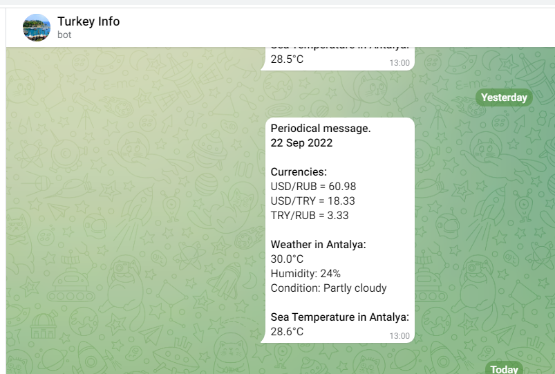
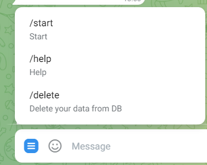

# TurkeyInfoBotSpring

## A small description of the work of the bot, with screenshots and scripts custom deployment to the server.

So, this bot is written in Java, Spring Boot, Spring Data JPA (PostgreSQL). Thanks to Telegram API it is able to respond to a number of commands (4 commands, the description will be below), form an information message (exchange rates and weather in Antalya), save it in the database and send it either on request and at the start of the bot, or regularly on a Cron schedule (using Spring).

Commands that can be handled by the bot:
1. /start - Saves the user in the table of users and also sends him the first informational message. If at the time of the request the table with messages was already formed today's message, the bot will take the existing information, if not - will send requests to several APIs for information to form a fresh message
2. /help - A simple text to chat with the bot about the bot's capabilities
3. /delete - Deletes a user from the table to stop sending him daily messages
4. /users - This command is not included in the bot menu. It allows the admin (the user with the given ID) to display a table with all the users in the chat. If this command is not sent by the bot owner - a message is printed in the chat about the lack of permission

After the bot worked correctly I configured its automatic deployment on the Ubuntu server: 
1. in the GitHub Action was a YAML script, which was triggered by a push to the master branch
2. on the Ubuntu server was created based on the JAR file from the project with the bot
3. YAML script runs a local script that pulls the updated code from GitHub, creates a new JAR file using Maven and restarts the service in Ubuntu using commands in the terminal

Script in GitHub Actions:
1. Trigger by push into Master
2. Script on remote server
   1. Stop service with JAR file
   2. Navigate to working directory
   3. Maven clean
   4. Git pull
   5. Maven package
   6. Start service with new JAR file

Useful command for service management and so on:
1. systemctl start telegram-bot.service
2. systemctl stop telegram-bot.service
3. systemctl status telegram-bot.service

Links used to create Linux service:
1. https://dzone.com/articles/run-your-java-application-as-a-service-on-ubuntu
2. https://linuxize.com/post/create-a-file-in-linux/#creating-a-file-using-heredoc

**P.S. Now the server with the bot is stopped so as not to pay for it constantly, but if necessary, you can quickly start everything again**